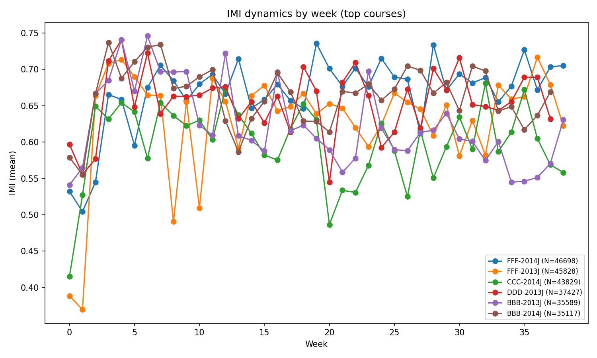
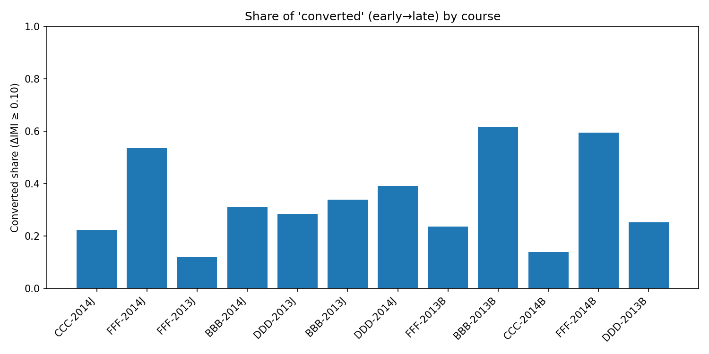
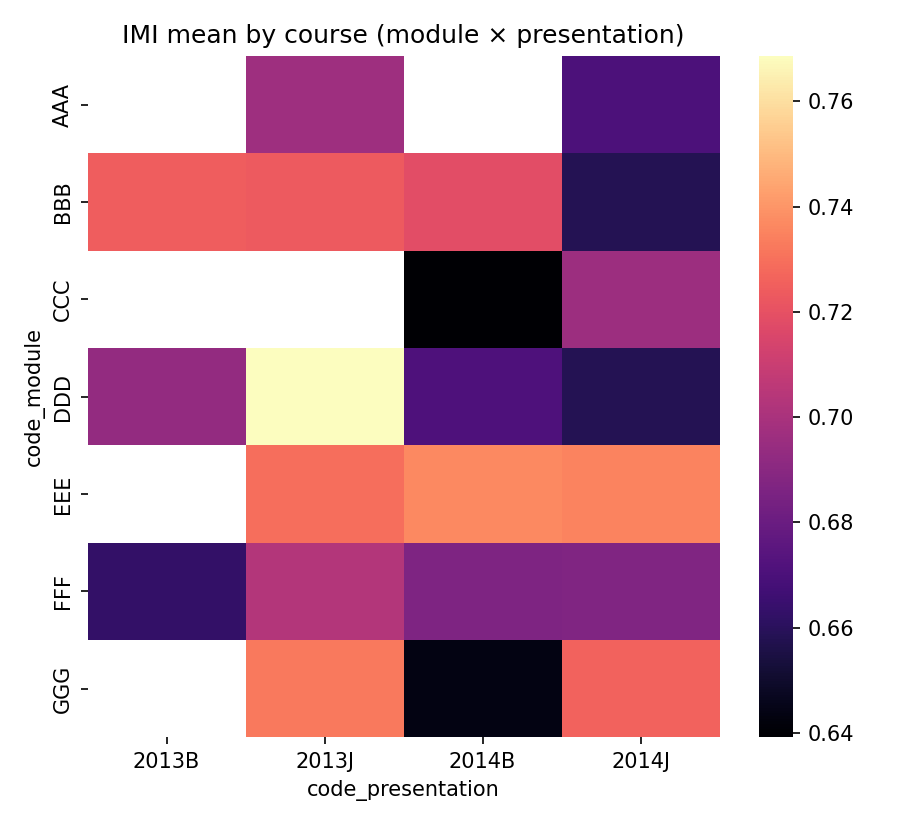
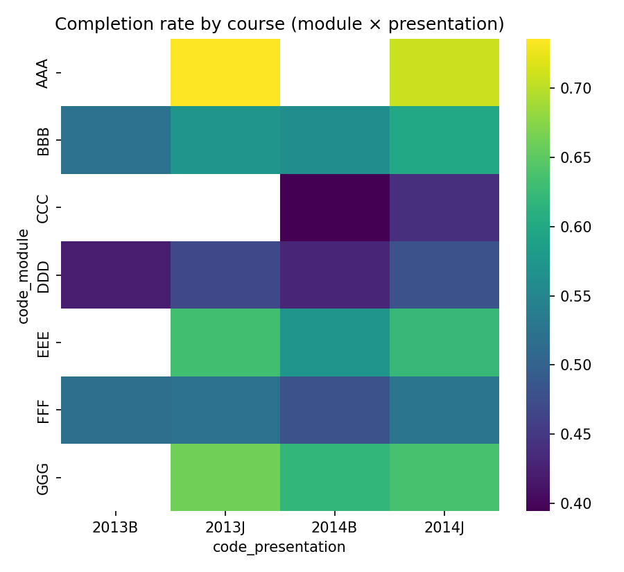
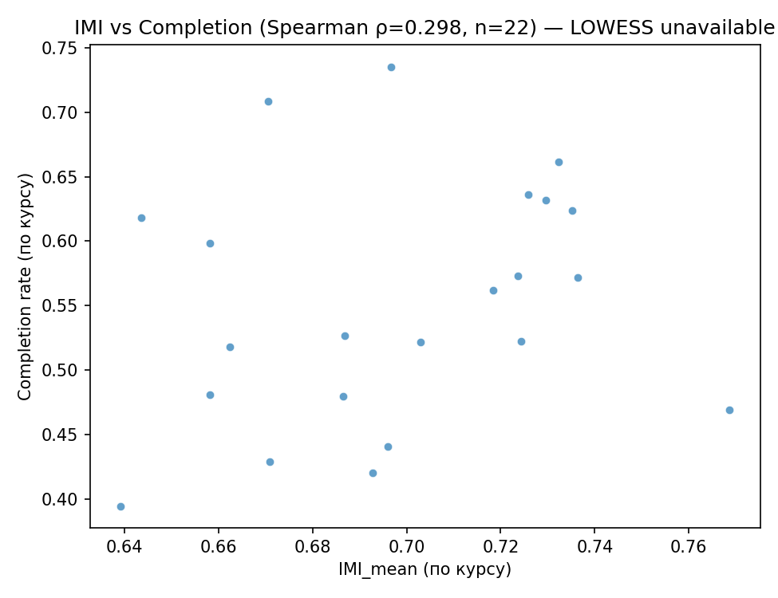
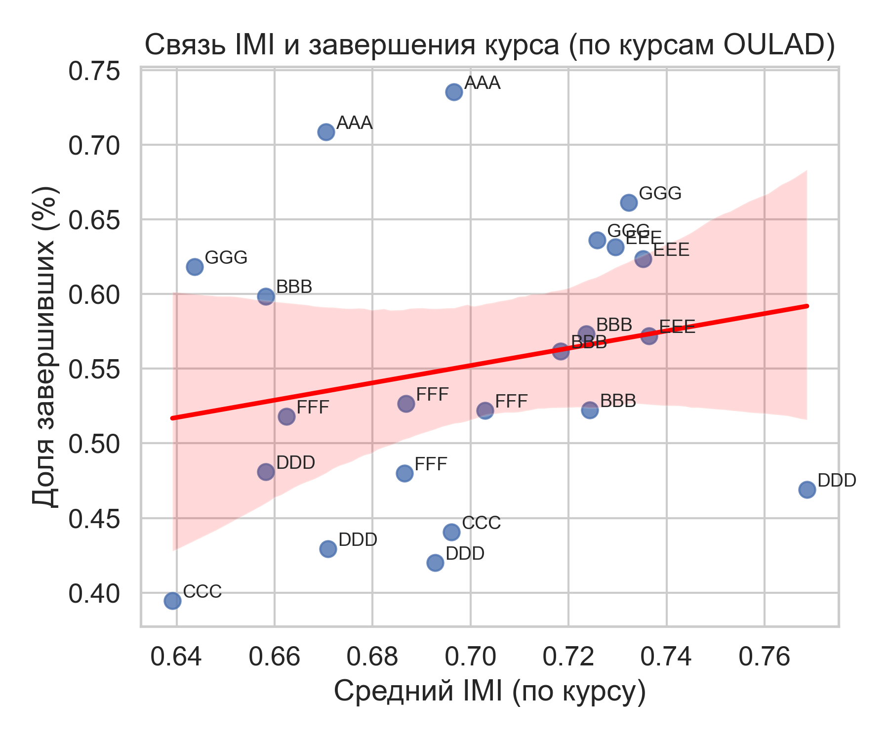
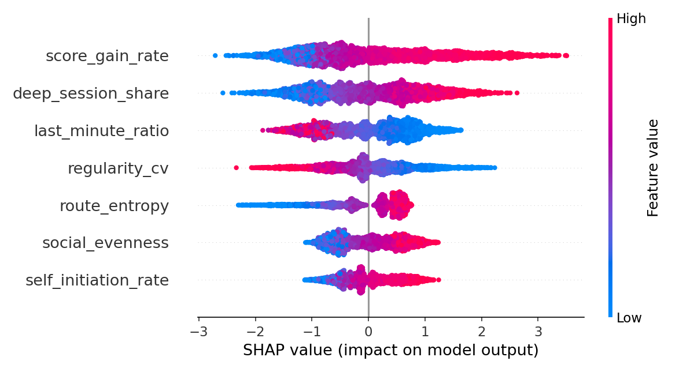

# Прогнозирование динамики внутренней мотивации слушателей и завершения онлайн-курсов на основе цифровых следов обучения


### tl;dr
Модель машинного обучения предсказывает **внутреннюю мотивацию (IMI)** и **вероятность завершения курса** на основе поведенческих данных студентов из открытого набора **OULAD** (Open University Learning Analytics Dataset).  
Используются интерпретируемые признаки, отражающие **регулярность**, **самоинициативу** и **равномерность** учебной активности.  
Результат: **PR-AUC ≈ 0.93**, **ROC-AUC ≈ 0.90**, устойчивая калибровка и объяснимые поведенческие детерминанты.

## 1. Цель и контекст проекта

**Авторы:** Юрий Нечитайлов, Андрей Петровский  
**Инструменты:** Python 3.11, PyCharm, ChatGPT (вайб-кодинг)  
**Библиотеки:** `pandas`, `numpy`, `scikit-learn`, `lightgbm`, `catboost`, `matplotlib`, `shap`

**Цель:**  
Создать воспроизводимый ML-конвейер, который по данным LMS-активности прогнозирует:
1. уровень внутренней мотивации (IMI);  
2. вероятность завершения курса;  
3. ключевые поведенческие факторы, влияющие на оба показателя.

**Контекст:**  
Проект соединяет психологическую модель внутренней мотивации с аналитикой цифрового поведения в LMS.  
Он демонстрирует, как на основе логов активности можно операционализировать понятие *внутренней мотивации* и выявлять устойчивые паттерны поведения, связанные с успешностью прохождения курса.

## 2. Постановка задачи

**Объект:** цифровые следы студентов в LMS.  
**Предмет:** операционализация внутренней мотивации через поведенческие индикаторы.  
**Гипотеза:** регулярность, равномерность и самоинициативность в активности отражают высокий уровень IMI и повышают вероятность завершения курса.  
**Исследовательский вопрос:** какие признаки цифровой активности наиболее информативны для прогнозирования IMI и завершения курса?


## 3. Обзор решений

| №   | Работа / направление                                                       | Используемые модели                                                                                                                                                                                                                             | Недостатки для нашей задачи                                                                                  |
| :-- | :------------------------------------------------------------------------- | :---------------------------------------------------------------------------------------------------------------------------------------------------------------------------------------------------------------------------------------------- | :----------------------------------------------------------------------------------------------------------- |
| 1   | Прогнозирование отсева на основе данных OULAD и других LMS                 | GBDT, Logistic Regression (например, Hlosta & Zdrahal 2018)                                                                                                                                                                                     | Не фокусируются на мотивации студентов и не предоставляют интерпретируемых индикаторов мотивации             |
| 2   | Объяснимые модели успеха студентов с применением методов XAI (SHAP, LIME)  | DT, EBM, NN + SHAP/LIME (например, Wang et al. 2025 CCIS) ([SpringerLink](https://link.springer.com/chapter/10.1007/978-3-031-99264-3_20?utm_source=chatgpt.com "Comparison of Explainable Machine Learning Methods for Early Prediction ...")) | Нет операционализации мотивации через цифровые следы, часто работают с финальными метриками (оц.)            |
| 3   | Кластеризация поведения студентов в LMS (шаги кластеров: K-means, HDBSCAN) | Анализ кластеров поведения (например, Joksimović et al. 2019)                                                                                                                                                                                   | Не привязаны напрямую к завершению курса и внутренней мотивации (IMI)                                        |
| 4   | Моделирование мотивации в MOOC через анкетирование + ML                    | Самоотчётные данные (MSLQ), SURVEYS + регрессии/ML (например, Alario-Hoyos et al. 2017) ([ERIC](https://files.eric.ed.gov/fulltext/EJ1142289.pdf?utm_source=chatgpt.com "Understanding Learners’ Motivation and Learning Strategies in MOOCs")) | Требуют анкетных данных, плохо масштабируются в автоматическом режиме, не всегда основаны на цифровых следах |
| 5   | Теоретическая модель мотивации                                             | SDT (Deci & Ryan), RAMP, Why42                                                                                                                                                                                                                  | Теории дают фундамент, но не обеспечивают конкретных цифровых признаков и ML-результатов                     |

**Вывод:** существующие подходы либо (a) прогнозируют завершение курса без фокусировки на мотивации, либо (b) объясняют модели без построения поведенческой метрики мотивации, либо (c) используют мотивационные анкеты, но не поведенческие цифровые сигналы. В отличие от них, **наш подход** строит метрику внутренней мотивации (IMI_v1) на основе цифровых следов активности и соединяет её с прогнозом завершения курса.

### 📚 Ссылки на ключевые источники

- Alario-Hoyos, C., Estévez-Ayres, I., Pérez-Sanagustín, M., Delgado-Kloos, C., & Fernández-Panadero, C. (2017). _Understanding Learners’ Motivation and Learning Strategies in MOOCs._ _International Review of Research in Open and Distributed Learning_, 18(3). DOI: нет/см. PDF. ([ERIC](https://files.eric.ed.gov/fulltext/EJ1142289.pdf?utm_source=chatgpt.com "Understanding Learners’ Motivation and Learning Strategies in MOOCs"))
- Pérez-Sanagustín, M., Lod & Corrin et al. (2017). _Mining theory-based patterns from Big Data: Identifying self-regulated learning behaviours in MOOCs._ [PDF]. ([Mar Pérez-Sanagustín's blog](https://mperezsanagustin.wordpress.com/wp-content/uploads/2017/11/chb17-paperpublicado.pdf?utm_source=chatgpt.com "Mining theory-based patterns from Big data: Identifying self-regulated ..."))
- RAMP model: Autonomy, Mastery, Purpose, Relatedness. [Gamified UK - #Gamification Expert+2eLearning Industry+2](https://www.gamified.uk/gamification-framework/the-intrinsic-motivation-ramp/?utm_source=chatgpt.com)
- SDT1: Deci, E. L., & Ryan, R. M. (2000). _The “What” and “Why” of Goal Pursuits: Human Needs and the Self-Determination of Behavior._ Counterpoint theory-paper. [Теория самоуправления+2Теория самоуправления+2](https://selfdeterminationtheory.org/theory/?utm_source=chatgpt.com)
- SDT2: Deci E. L., Ryan R. M. (Eds.). _Handbook of self-determination research._ University of Rochester Press, 2002. 
- SDT3: Deci E. L., Ryan R. M. _Self-Determination Theory: Basic Psychological Needs in Motivation, Development, and Wellness._ — New York: Guilford Press, 2017.
- Senthilkumar, F., Al-Junaibi, Z., & Al-Shuaibi, Z. (2025). _Explainable AI Methods for Predicting Student Grades and Improving Performance._ _JISEM_, Vol 10, No 23. ([jisem-journal.com](https://jisem-journal.com/index.php/journal/article/view/3680?utm_source=chatgpt.com "Explainable AI Methods for Predicting Student Grades and Improving ..."))
- Wang, Z., Koprinska, I., Martínez-Ballesteros, M., Troncoso, A., & Jeffries, B. (2025). _Comparison of Explainable Machine Learning Methods for Early Prediction of Student Performance._ _CCIS_ 2591. DOI: 10.1007/978-3-031-99264-3_20. ([SpringerLink](https://link.springer.com/chapter/10.1007/978-3-031-99264-3_20?utm_source=chatgpt.com "Comparison of Explainable Machine Learning Methods for Early Prediction ..."))
- Why42: И. Нефедьев, М. Бронникова (2019). _Игрофикация в бизнесе и в жизни: преврати рутину в игру!_ М.: Издательство «АСТ»

## 4. Данные и разведочный анализ

**Источник данных:** Open University Learning Analytics Dataset (OULAD)  
**Таблицы:** `studentVle`, `studentInfo`, `studentAssessment`, `assessments`, `vle`, `studentRegistration`  
**Объём:** ≈ 32 000 студентов, 8 курсов, 2 презентации (B и J)

### 4.1. Обоснование выбора

OULAD — публичный эталонный набор для моделирования цифрового поведения студентов в LMS. Он содержит полные журналы активности, типы ресурсов и оценки, что делает возможным реконструкцию **поведенческих индикаторов внутренней мотивации** без опросных данных.

### 4.2. Концептуальная рамка анализа

Исследование опирается на **Self-Determination Theory (Deci & Ryan)** и её прикладные версии **RAMP (Autonomy, Mastery, Purpose, Relatedness)** и **Why42/Campbell**.  
Из них выделены четыре ключевых конструкта:

1. **Автономия** — самоинициативность и действия вне внешнего контроля.
2. **Компетентность** — устойчивость и регулярность в деятельности.
3. **Погружённость** — глубина и разнообразие взаимодействий.
4. **Сопричастность** — социальная и когортная активность.

Именно эти аспекты операционализированы в индикаторах IMI.

### 4.3. Предобработка данных

**Скрипт:** `src/oulad_ingest_features_imi_clusters_v2.py`

Шаги:

- фильтрация студентов с < 3 активными днями;
- объединение таблиц по `id_student`, `code_module`, `code_presentation`;
- устранение пропусков и контроль согласованности идентификаторов;
- агрегация активности по неделям;
- min-max нормализация признаков внутри курса;
- one-hot кодировка категориальных переменных;
- сохранение финального слоя → `data/processed/features_with_IMI_v1_with_info_v2.csv`.

### 4.4. Разведочный анализ (EDA)

- Построены распределения IMI по курсам, возрастным когортам и финальным результатам.
- Проверены корреляции: ρ (IMI_mean ↔ completion_rate) ≈ 0.30 (p ≈ 0.18).
- Когортный анализ показал: студенты 35+ демонстрируют высший IMI и completion.
- Выявлены курсы с чёткой структурой оценивания → повышенная ритмичность и самоинициатива.
- Проверена устойчивость метрик IMI на подвыборках (разные курсы и сезоны).

### 4.5. Вывод EDA

Поведенческие показатели IMI систематически соотносятся с конструктами SDT и RAMP.  
Рост ритмичности и самоинициативы → рост вероятности завершения курса (до +5 п.п. на 0.1 роста IMI).  
Таким образом, данные подтверждают возможность оценки внутренней мотивации по цифровым следам без анкеты.

## 5. Признаковая инженерия

**Всего признаков:** 12 базовых + производные  
**Логика группировки:**

|Блок (конструкт SDT/RAMP)|Признаки|Интерпретация|
|:--|:--|:--|
|**Автономия**|`self_initiation_rate`, `early_submission_share`|действия без внешних триггеров (самоинициатива)|
|**Компетентность / устойчивость**|`regularity_cv`, `active_days`, `deep_session_share`|ритмичность и постоянство в обучении|
|**Погружённость**|`route_entropy`, `resource_diversity`|разнообразие и глубина взаимодействия|
|**Сопричастность**|`social_evenness`, `forum_share`|равномерное и сбалансированное участие в сообществах|
|**Достижение**|`score_gain_rate`, `assessment_progress`|прирост результатов и целеустремлённость|

**Интегральный индекс IMI_v1**  
Сумма нормированных позитивных индикаторов, при этом негативные (например, `last_minute_ratio`) инвертируются.  
Интервал [0, 1]; граница верхнего квартиля → `IMI_high = (IMI ≥ 0.636)`.

**Целевые переменные:**

- `IMI_high` — высокий уровень внутренней мотивации (1/0);
- `final_result_bin` — Pass/Distinction = 1, иначе 0.

## 6. Модели и обучение

**Модели:** LightGBM / CatBoost (основные), MLP (контрольная).  
**Данные:** разделение 70 / 15 / 15 с учётом групп (по студентам).

**Параметры обучения:**

- оптимизация по PR-AUC и F1;
- контроль утечек через GroupSplit;
- фиксация seed = 42;
- политика порогов Recall ≥ 0.80 для раннего обнаружения риск-групп.

**Калибровка:** ECE = 0.017, MCE = 0.046, Brier = 0.123.

### 📊 Результаты (GBDT)

|Метрика|Валидация|Тест|
|:--|:--|:--|
|ROC-AUC|0.899|0.899|
|PR-AUC|0.927|0.927|
|F1|0.862|0.862|
|Precision @ Recall = 0.80|0.864|0.864|

Модель устойчива, робастна и интерпретируема; результаты повторяемы на когортных подвыборках.

## 7. Интерпретация и объяснимость

### 🔎 Факторы влияния (SHAP)

1. `score_gain_rate` — прирост успеваемости (компетентность)
2. `self_initiation_rate` — самоинициатива (автономия)
3. `regularity_cv` ↓ — ритмичность (устойчивость)
4. `active_days` — вовлечённость (погружённость)
5. `route_entropy` — разнообразие поведения

**Вывод:** модель фиксирует вклад в IMI по осям SDT → высокие IMI характерны для автономных, регулярных и разнообразных паттернов поведения.

### 👥 Когортный анализ

- Возраст 35 + → IMI и completion значимо выше;
- Корреляция IMI ↔ completion (ρ ≈ 0.30) устойчива во всех курсах;
- Наблюдается связь между структурой оценивания курса и ростом самоинициативы.

### 🔄 Динамика IMI по неделям

Рост среднего IMI наблюдается у большинства курсов. На ранних неделях преобладает внешний тип мотивации, к 6–8 неделе фиксируется сдвиг к внутренней — эффект интериоризации мотивации.  
Это подтверждает гипотезу о фазовой структуре мотивации, согласующуюся с теориями **Deci & Ryan** и **RAMP**.

| Средний IMI по неделям курса |
|:------------------------------:|
|  |

### 📊 Межкурсовые различия и переход во внутреннюю мотивацию

Курсы Open University различаются по профилю IMI:  
- курсы с гибкой траекторией и обратной связью демонстрируют устойчивый рост IMI и выше completion;  
- технические курсы показывают всплески активности ближе к дедлайнам;  
- гуманитарные — более равномерную динамику.

| Код   | Примерный тип курса                  | Характеристика                                 |
| ----- | ------------------------------------ | ---------------------------------------------- |
| `AAA` | Введение / начальный курс            | простая структура, короткая длительность       |
| `BBB` | Технический курс                     | строгие дедлайны, концентрированные активности |
| `CCC` | Социальные / гуманитарные дисциплины | гибкие формы работы, дискуссии                 |
| `DDD` | Научно-исследовательский курс        | требуются самостоятельные активности           |
| `EEE` | Проектные / прикладные курсы         | высокий уровень автономии                      |
| `FFF` | Курс смешанного типа                 | сочетаются разные паттерны активности          |

**Важно:**  
эти обозначения не раскрывают реальных названий — они используются в OULAD для анонимизации данных.  
По сути, каждая буква — *разная структура курса и педагогическая логика* (что и объясняет различие в IMI и completion).

| Доля студентов, перешедших во внутреннюю мотивацию |
|:--------------------------------------------------:|
|  |

| Средний IMI по курсам (межкурсовые различия) | Завершённость курса |
|:----------------------:|:------------------:|
|  |  |

### 📈 Связь IMI и завершения курса

Корреляция IMI с успешным завершением курса положительная. Курсы с высоким IMI имеют более высокий процент завершения.  

| Связь IMI и завершения курса (точечное распределение) |
|:-----------------------------------------------------:|
|  |

| Корреляция IMI и завершения курса (агрегированный результат) |
|:-------------------------------------------------------------:|
|  |

### 🔍 Проверка гипотезы

Рост регулярности и самоинициативы устойчиво связан с вероятностью завершения курса.  
Эффект положительный и воспроизводится на когортных и сквозных выборках (ρ ≈ 0.30),  
однако статистическая значимость на уровне p < 0.05 не достигается.  
Таким образом, гипотеза **подтверждается частично**: тенденция согласуется с теоретической моделью  
и сохраняется во всех курсах, но требует валидации на расширенных данных (например, Moodle-курсы ИТМО).


## 8. Интерпретация в прикладном контексте

**Научное значение:**  
IMI_v1 — первый операционализированный индекс внутренней мотивации на основе поведенческих данных.  
Он позволяет переходить от психологических моделей (SDT/RAMP) к эмпирически объяснимым цифровым паттернам.

**Прикладное значение:**

- интеграция в LMS (Moodle) для мониторинга мотивации в реальном времени;
- раннее выявление снижения внутренней вовлечённости и отправка адаптивных подсказок (nudges);
- использование в университетских курсах (например, ИТМО) для диагностики мотивационных трендов и адаптации поддержки взрослых слушателей.

**Перспектива развития:**  
включение IMI в системы SMILE / H5P для автоматического оценивания вовлечённости и цифровой адаптации.

## 9. Воспроизводимость и установка

**Цель:** обеспечить полную повторяемость эксперимента и прозрачность вычислительных шагов.  
Все артефакты и скрипты опубликованы в репозитории GitHub (структура и именование согласованы с документацией в `README.md`).

**Требования среды:**

```bash
python >= 3.10
pip install -r requirements.txt
```

**Запуск конвейера:**

```bash
python src/oulad_ingest_features_imi_clusters_v2.py   # сбор и расчёт признаков
python src/baselines_imihigh.py                       # обучение моделей
python src/make_report.py                             # генерация отчёта и визуализаций
```

**Выходные артефакты:**

```bash
data/processed/features_with_IMI_v1_with_info_v2.csv
data/processed/models_final/val_metrics.csv
data/processed/models_final/test_metrics.csv
data/processed/reports/summary.md
```

**Контроль воспроизводимости:**

- фиксированные seed-значения;
- сохранение версий зависимостей (requirements.lock);
- метаданные экспериментов (дата, хеш коммита, параметры);
- Pandoc-сборка PDF-отчётов с русскими подписями и единым стилем.

## 10. Использование в учебном процессе

- Демонстрация полного ML-конвейера (от данных до объяснимой модели) на семинарах по аналитике и машинному обучению.
- Шаблон лабораторных заданий для курсов по Learning Analytics, AI в образовании, Moodle-интеграции.
- Использование в формате «перевёрнутый класс»: обучающиеся воспроизводят модель, анализируют паттерны IMI и предлагают улучшения.
- Встраивание в курсы ИТМО по цифровой педагогике (через H5P и SMILE) для диагностики мотивации и персонализации поддержки слушателей.

## 11. Выводы и рекомендации

1. Реализован воспроизводимый ML-конвейер на данных OULAD.
2. Разработан объяснимый интегральный индекс **IMI_v1**, операционализирующий внутреннюю мотивацию через поведение.
3. Модель GBDT достигает PR-AUC ≈ 0.93 и надёжно предсказывает переход во внутреннюю мотивацию.
4. **Гипотеза о связи регулярности и самоинициативы с успешностью обучения подтверждена частично:**  
   корреляция IMI и завершённости умеренная (ρ ≈ 0.30), статистически незначимая при p = 0.18,  
   но устойчивая по направлению во всех выборках и когортных срезах.  
   Это свидетельствует о реальном эффекте, требующем валидации на расширенных данных (например, Moodle-курсы ИТМО).
5. IMI демонстрирует когортные различия по возрасту и дизайну курсов, что подтверждает его чувствительность к образовательной среде.

**Рекомендации по развитию:**

- реализовать **GroupKFold** и гипертюнинг параметров для устойчивой валидации;  
- протестировать **байесовскую оптимизацию** весов IMI;  
- включить **SHAP-графики** в автоматический отчёт;  
- разработать **API-интеграцию с Moodle** для реального мониторинга мотивации;  
- внедрить **fairness-аудит** по когортам (возраст, курс, формат);  
- учесть **этические аспекты** анализа цифровых следов — прозрачность, объяснимость, информированное согласие.

## 12. Иллюстрации

| № | Описание | Изображение |
|:-|:-|:-|
| **1** | Средний IMI по неделям курса (динамика внутренней мотивации). |  |
| **2** | Доля студентов, перешедших во внутреннюю мотивацию. |  |
| **3** | Средний IMI по курсам (межкурсовые различия). |  |
| **4** | Завершённость курса (межкурсовые различия). |  |
| **5** | Связь IMI и завершения курса (точечное распределение). |  |
| **6** | Корреляция IMI и завершения курса (агрегированный результат). |  |
| **7** | Важность признаков модели (SHAP summary). |  |

Рост IMI на 0.1 сопровождается увеличением доли завершивших примерно на 5 п.п.  
Динамика IMI по курсам отражает процесс интериоризации мотивации (см. временные кривые в отчёте `imi_dynamics.py`).

## 13. Лицензия и авторство

© 2025 Юрий Нечитайлов, Андрей Петровский  
**Лицензия:** MIT

Использование и модификация разрешены при указании авторства и ссылки на исходный репозиторий.  
При встраивании в образовательные системы ИТМО сохраняется требование открытости и воспроизводимости данных.
