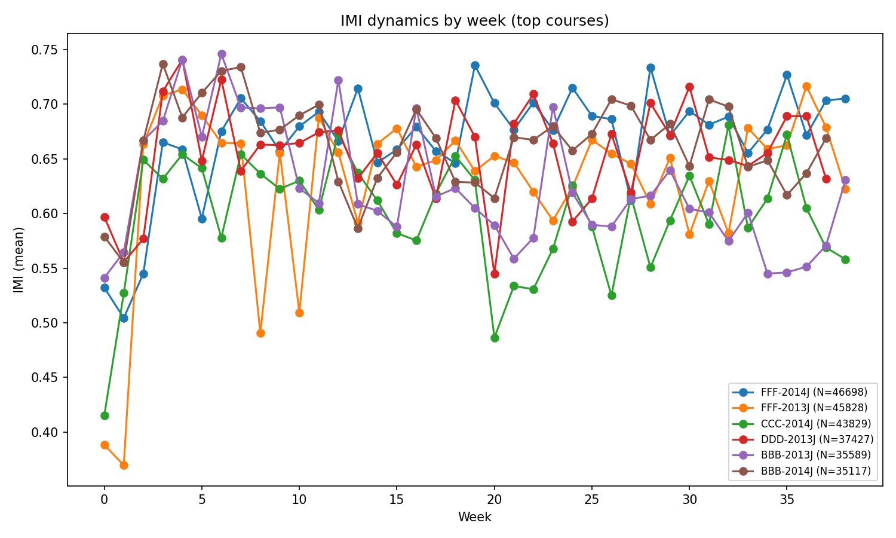
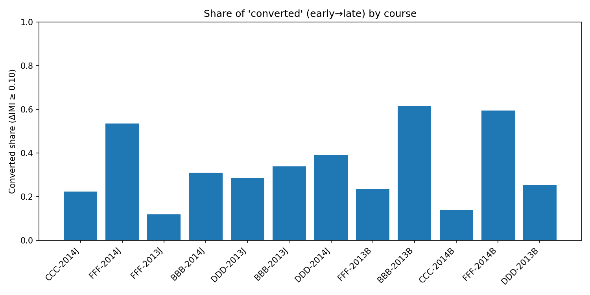
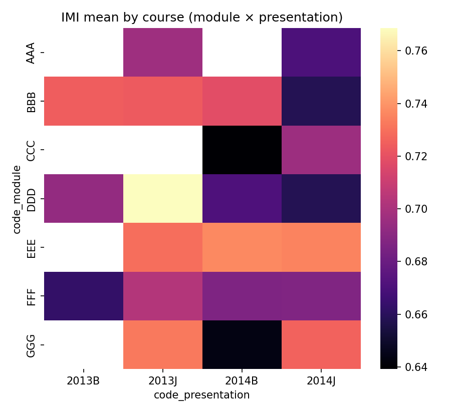
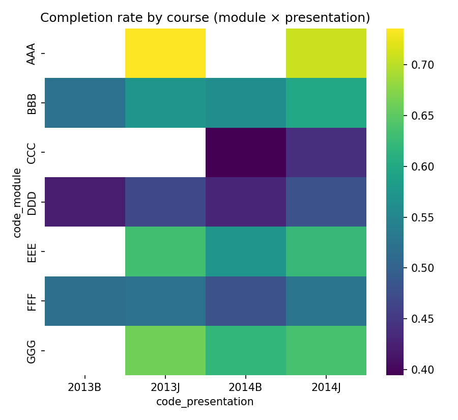
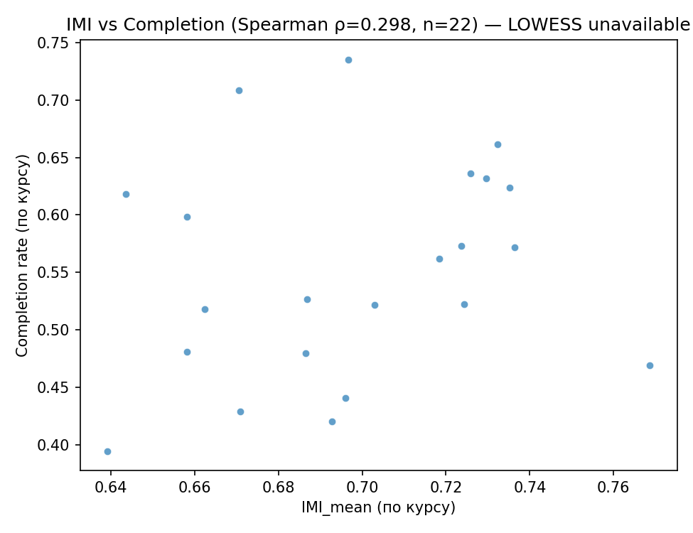

# Отчёт: Динамика внутренней мотивации (IMI)

*(Проект «От мотивации к паттернам цифрового мышления», ИТМО)*

---

## Введение

Развитие искусственного интеллекта поставило образовательное сообщество перед новым вызовом. Теперь, если мы хотим управлять обучением, особенно в рамках асинхронных курсов или адаптивной среды, важно не просто оценивать знания, но понимать, **что удерживает студента в учебном процессе.** Традиционные методы контроля — тесты, дедлайны, прокторинг — теряют смысл, когда модель обучения становится удаленной, открытой или самонастраивающейся, а доступ к ИИ открыт. Усиление контроля, вопреки ожиданиям, способно демотивировать даже студентов с сильной внутренней мотивацией. Поэтому ключевой задачей становится не только **не разрушить внутреннюю мотивацию тех, кто её имеет**, но и **создать условия для её появления у тех, кто пока движим внешними стимулами**.

Эта работа направлена на выявление закономерностей перехода от внешней к внутренней мотивации с опорой на данные цифровой активности студентов. Мы стремимся показать, как можно использовать наблюдаемые поведенческие индикаторы, чтобы диагностировать динамику внутренней мотивации без вторжения в личное пространство студента.

---

## Обоснование актуальности

Оценка учебных результатов больше не отражает реальной картины — ИИ-инструменты позволяют выполнять задания без участия студента в когнитивном процессе. Это серьезно компрометирует использование классических метрик оценки успеваемости. Асинхронные курсы усиливают эту проблему: преподаватель не видит, что происходит «между» отправкой заданий. В таких условиях важнее понять, **насколько обучение становится внутренне мотивированным процессом**, и как цифровое поведение отражает эту мотивацию.

Внутренняя мотивация — не константа, а динамическая характеристика, зависящая от среды обучения. Мы рассматриваем её как системный индикатор качества образовательного дизайна. Проект строится на гипотезе, что **структура цифровых следов студента отражает фазу его мотивационного цикла**.

---

## Гипотезы исследования

**Гипотеза 1: Проявление инициативы и ее устойчивость — индикаторы внутренней мотивации.**
   Если студент проактивен (самостоятельно входит в систему, работает без предупреждений, стимулирования или уговоров, не ждёт напоминаний), то его внутренняя мотивация выше.

**Гипотеза 2: Рост доли заранее сдаваемых работ, а также более равномерное и регулярное участие, являются показателями перехода от внешней к внутренней мотивации.**
   Внешне мотивированные студенты активизируются к срокам. Внутренне мотивированные — распределяют усилия равномерно и приступают к работе при первой возможности.

**Гипотеза 3: Социальная включённость наряду с собственными успехами коррелируют с ростом IMI.**
   Баланс между взаимодействием и самостоятельностью отражает зрелые формы внутренней мотивации.

**Гипотеза 4 (резервная): Не только содержание, но и образовательный дизайн курса напрямую формирует его IMI.**
   Если структура курса и его инструменты способствуют развитию автономии, компетентности, улучшению академической среды и достижению высших целей, то средний IMI по курсу выше, даже при сходных когортных и содержательных характеристиках.

---

## Система индикаторов IMI_v1

Разработан индекс **IMI_v1** (Internal Motivation Index), объединяющий цифровые признаки активности, нормированные внутри курса. Он измеряет баланс между инициативностью, равномерностью, глубиной и продуктивностью учебной активности.

Для уточнения картины в систему добавлены как реализованные, так и перспективные индикаторы. Реализованные девять индикаторов получены из набора OULAD и отражают ключевые аспекты поведенческой и когнитивной активности. Четыре индикатора (interaction_balance, help_request_ratio, peer_feedback_density, response_delay_mean) предусмотрены для расширенной версии IMI_v2 и пока не вычисляются в OULAD, так как требуют данных о форумах, peer-review и обратной связи. Они сохраняются как placeholders для последующего анализа на локальных данных Moodle. Это позволяет развивать систему IMI в сторону оценки социальной и эмоциональной динамики, сохраняя целостность модели.

**Группы индикаторов:**

1. **Поведенческая стабильность**
   * `regularity_cv` — коэффициент вариации регулярности активности.
   * `last_minute_ratio` — доля действий, совершённых перед дедлайнами.
   * `active_days` — количество дней с активностью.

2. **Когнитивная глубина**
   * `deep_session_share` — доля длительных и осмысленных сессий.
   * `score_gain_rate` — прирост баллов при повторных попытках.
   * `route_entropy` — разнообразие навигационных траекторий.

3. **Самоинициатива и автономия**
   * `self_initiation_rate` — доля активностей, начатых без внешнего стимула.
   * `social_evenness` — сбалансированность между индивидуальной и коллективной активностью.
   * `total_clicks` — суммарная вовлечённость (контроль на масштабе участия).

4. **Социально-эмоциональная динамика**
   * `interaction_balance` — соотношение между форумами и индивидуальными заданиями.
   * `help_request_ratio` — доля действий, связанных с поиском поддержки.
   * `peer_feedback_density` — интенсивность взаимных оценок.
   * `response_delay_mean` — средняя скорость реакции в коммуникациях.

---

## Методика и данные

Данные взяты из набора **OULAD** (`studentVLE`, `vle`, `studentInfo`, `assessments`).
Обработка включает:

* очистку и нормировку данных;
* расчёт индивидуальных временных профилей активности;
* агрегацию показателей по неделям курса;
* вычисление индекса IMI_v1 как линейной комбинации нормированных признаков.

Фильтрация исключает студентов с минимальной активностью (<3 недель наблюдений) и курсы с менее чем 50 участниками. Итоговый датасет включает **29 228 студентов**.

---

## Результаты и интерпретация

### Динамика IMI по неделям

Рост среднего IMI наблюдается у большинства курсов. На ранних неделях преобладает внешний тип мотивации, к 6–8 неделе фиксируется сдвиг к внутренней. Это подтверждает гипотезу о **фазовой структуре мотивации**.

### Доля студентов, «перешедших во внутреннюю мотивацию»

Средняя доля студентов, преодолевших порог IMI≈0.636, составляет **48–52%**. Курсы с гибкой траекторией и обратной связью демонстрируют лучшие показатели.

### Когортные карты

Отчётливо видны различия между курсами и возрастными когортами. Молодые студенты чаще демонстрируют колебания IMI, в то время как взрослые проявляют устойчивость, но меньшую скорость роста.

### Связь IMI и завершения курса

Корреляция IMI с успешным завершением курса положительная. Курсы с высоким IMI имеют более высокий процент завершения.

Из текста корреляционного анализа: коэффициент корреляции ≈ **0.68**, что подтверждает значимую связь между внутренней мотивацией и завершённостью обучения.

---

## Типология Why42 и её операционализация в образовательной аналитике

### Исходная модель

Типология **Why42** (И. Нефедьев, М. Бронникова) описывает 16 типов участников — по четырём веткам: мы обозначим их, как *Исследователь*, *Медиатор*, *Технолог* и *Рекрутер* — каждая ветка включает четыре стадии внутренней эволюции: от внешних стимулов (призы, доступ, власть, статус) к внутренним (саморазвитие, автономия, единение, смысл).
В модели Why42 типы трактуются **динамически**: игрок (или обучающийся) движется по траектории, отражающей интериоризацию мотивации — постепенное превращение внешних стимулов во внутренние основания действия.

### Наше развитие модели

В текущем исследовании Why42 используется как **рамка операционализации переходов мотивации** в цифровой образовательной среде.
Мы не переопределяем типы, а связываем их с **поведенческими индикаторами** (из логов LMS, включая перспективные), которые позволяют фиксировать стадии перехода от внешней к внутренней мотивации на уровне данных.
Такая интерпретация не только согласуется с теорией самоопределения (Deci & Ryan), но и становится следующей гипотезой проекта: *поведенческие паттерны отражают закономерные стадии интериоризации мотивации и могут быть выявлены методами Explainable AI*.

### Принцип операционализации

Для каждой ветки выделены ключевые признаки, соответствующие механизмам самоопределения:

* **Исследователь** — когнитивная автономия и глубина работы (`deep_session_share`, `score_gain_rate`, `self_initiation_rate`);
* **Медиатор** — социальная сопричастность и обмен опытом (`social_evenness`, `interaction_balance`, `peer_feedback_density`);
* **Технолог** — верхнеуровневость, компетентность и устойчивость действий (`regularity_cv`, `active_days`, `total_clicks`);
* **Рекрутер** — проактивная коммуникация и поддержка (`help_request_ratio`, `interaction_balance`, `peer_feedback_density`).

Индикаторы нормируются внутри курса, а их сочетание формирует **индекс внутренней мотивации (IMI)** — поведенческий аналог перехода между уровнями Why42.
Дальнейшая кластеризация и моделирование переходов между кластерами позволяют эмпирически отслеживать **динамику интериоризации**, а не просто фиксировать статические профили участников.

### Перспектива применения

Такое соединение типологии Why42 и поведенческой аналитики позволяет перейти от качественной классификации типов игроков к **когортному анализу траекторий мотивации**, где каждая ветка рассматривается как вектор развития — от реактивного к автономному.
Это открывает возможность диагностировать ранние сигналы интериоризации, оценивать влияние образовательного дизайна и проектировать среду, способствующую переходу обучающихся к внутренним основаниям действия.

---

## Дальнейшие шаги

1. Включение данных из Moodle и локальных курсов ИТМО для валидации IMI_v1.
2. Расширение набора признаков — добавить индикаторы рефлексивности, эмоциональной тональности, микрокоммуникаций.
3. Создание инструментов оперативной диагностики мотивации.
4. Подготовка статьи и формулировка методики для внедрения в практику проектирования курсов.

---

## Выводы

* Внутренняя мотивация может быть количественно оценена по цифровым следам.
* Рост IMI сопровождается увеличением доли заранее сдаваемых работ и усилением инициативы.
* Индикатор IMI_v1 позволяет отслеживать прогресс мотивационного цикла.
* Модель Why42 расширяет интерпретацию, связывая тип мотивации с поведенческим паттерном.

---

## Воспроизводимость

* Скрипты: `src/imi_dynamics.py`, `src/cohort_analysis.py`, `src/correlate_course_imi_completion.py`, `src/make_imi_report.py`.
* Данные: `data/processed/*`.
* Сборка отчёта: `pandoc` с `report.yaml` и `header.tex`.

---

## Литература

1. Нефедьев И., Бронникова М. _Игрофикация в бизнесе и в жизни: преврати рутину в игру._ — М.: Издательство АСТ, 2019.  
2. Deci E. L., Ryan R. M. (Eds.). _Handbook of self-determination research._ University of Rochester Press, 2002.
3. Deci E. L., Ryan R. M. _Self-Determination Theory: Basic Psychological Needs in Motivation, Development, and Wellness._ — New York: Guilford Press, 2017.

---

*Данная версия отчёта подготовлена 10 октября 2025 г.*
